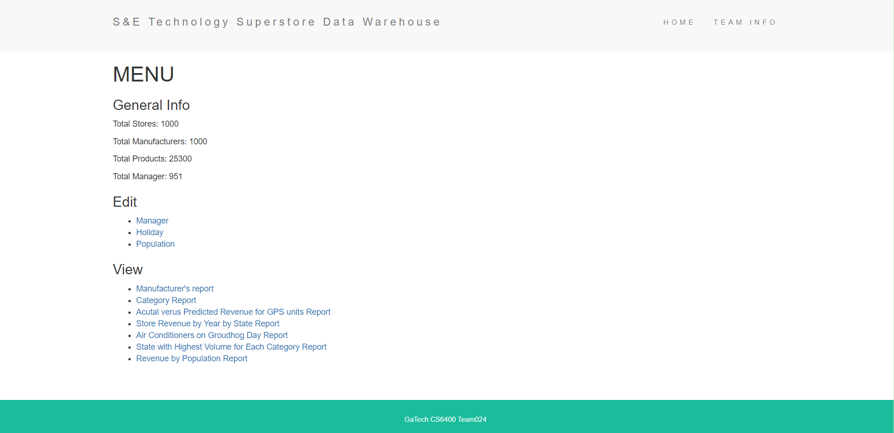
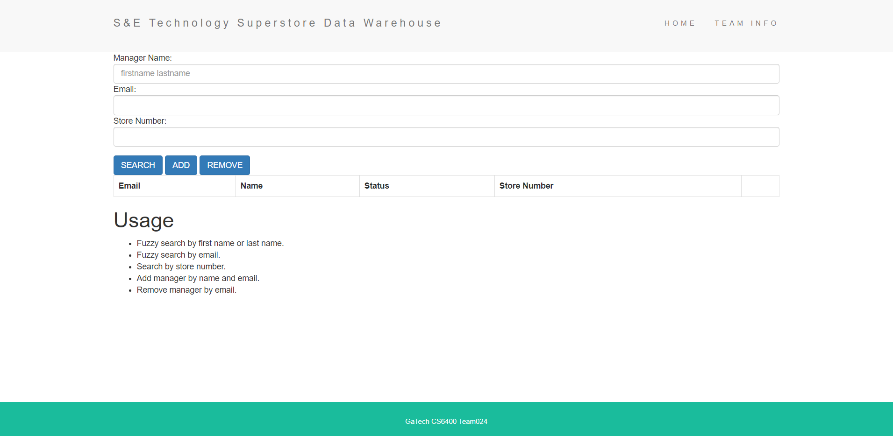
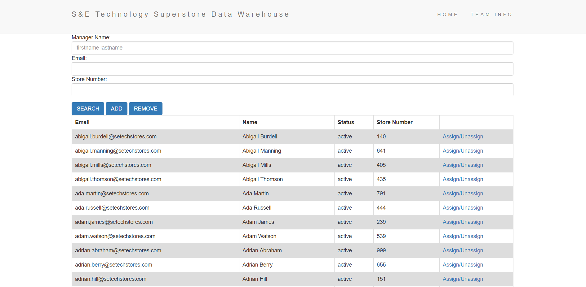
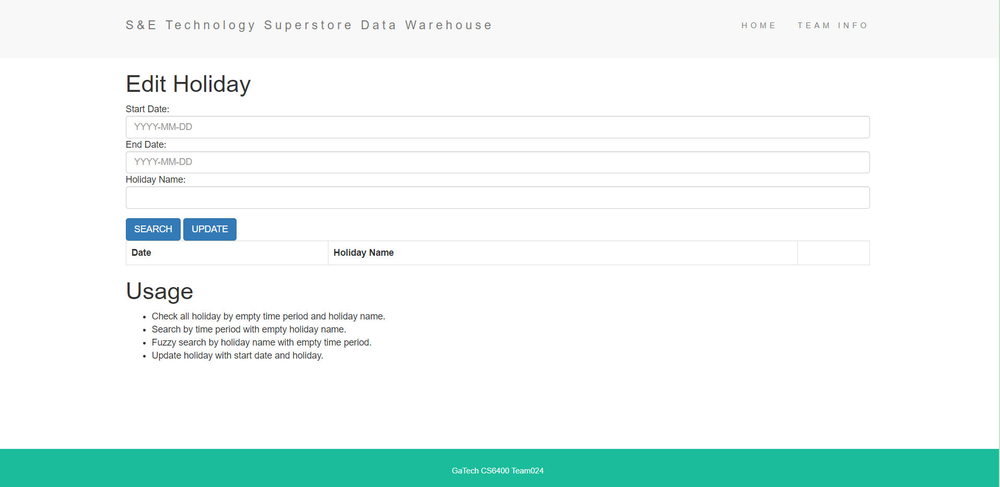
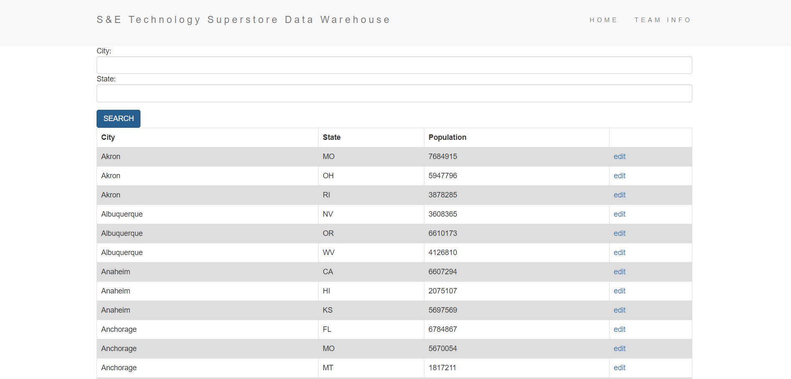
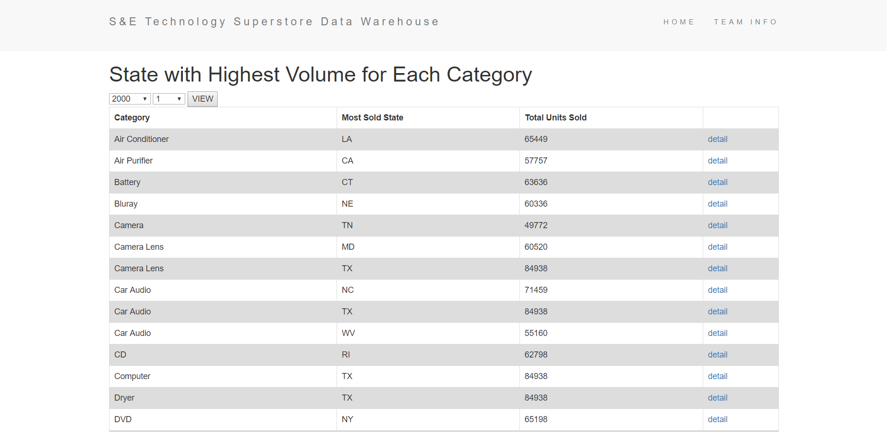

# S-E-Data-Warehouse

## DESCRIPTIONS:
This repro is the team project of Georgia Tech CS 6400 Database Systems Concepts and Design. 
An web app was created to manage the data warehouse and generate different reports for sales analysis. 
Project requirements and detailed development docs such as DB schema, constraints and etc. could be find at ./docs

## TECH FRAMEWORK:
Node.js, Express, EJS, jQuery, Bootstrap, MySQL

## APP FUNCTIONS:

1.	Main Page

2. Check/Edit Manager 

2. Check/Edit Holiday

2. Check/Edit Population

5.	Selected Data Report:

